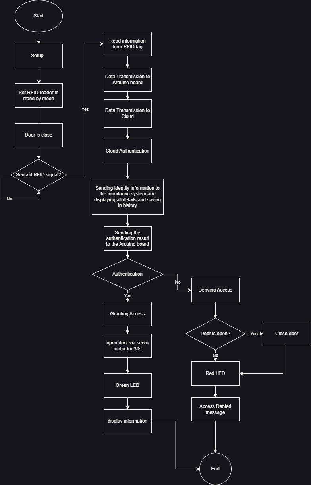

# IoT-Based Entry and Exit Management System

## Project Overview

This project develops a system to control the entry and exit of individuals in a company using IoT technologies. The system utilizes RFID for identification and an Arduino board equipped with an ENC28J60 Ethernet module to handle door mechanisms and data transmission. A simple web server is implemented in the cloud to manage access permissions, and a monitoring system is set up to track and display entry events.

## Features

- **RFID Authentication:** Utilizes RFID sensors and tags to identify individuals entering or exiting the facility.
- **Arduino Control:** Manages door operations such as opening and closing based on authentication status using a servo motor.
- **Web Server:** Hosts a simple server in the cloud to store a list of authorized individuals and handle authentication requests.
- **Monitoring System:** A GUI monitoring system that displays entry events as they occur, developed using Qt and WebSockets for live data updates.

## System Setup

### Hardware Components

- RFID sensor and tags
- Arduino board
- ENC28J60 Ethernet module
- Servo motor for door control
- LEDs for status indication (green for access granted, red for denied)

### Software Requirements

- **Arduino IDE:** For programming the Arduino board.
- **Qt Creator:** For developing the GUI monitoring system.
- **Proteus Software:** For simulating the hardware setup. (Physical components are not available.)

## Installation and Configuration

1. **Arduino Setup:**
   - Install the Arduino IDE and load the provided script.
   - Connect the ENC28J60 module and configure it for Ethernet access.
   - Attach the RFID sensor, servo motor, and LEDs as per the circuit diagram provided.

2. **Web Server Implementation:**
   - Set up a basic HTTP server that can handle requests and send responses to the Arduino board.
   - Ensure the server can perform updates on client using WebSockets.

3. **Monitoring System:**
   - Use Qt Creator to develop the GUI.
   - Implement the WebSocket client in the GUI to receive updates from the web server.

## Flowchart

The flowchart provides a visual guide to the sequence of operations when an individual attempts to enter the premises using our IoT-based Access Control System. Below is the detailed process as shown in the flowchart:

1. **Start (Setup)**: The system initializes and sets the RFID reader to standby mode, preparing to detect any RFID tag presented by an individual trying to gain entry.

2. **RFID Tag Detection**: When a person approaches, the system checks if the door is closed and then waits for an RFID signal. If a tag is present, it reads the information from the RFID tag.

3. **Data Handling**: Once the RFID reader detects a tag, it sends the data to the Arduino board, which then transmits this information to the cloud for authentication.

4. **Cloud-Based Authentication**: The cloud server receives the RFID data and authenticates the identity of the individual by comparing the received data against a list of authorized IDs.

5. **Response and Action**: Upon authentication, the cloud sends the identity information to the monitoring system, displaying all details and saving the event in the system's history. It also sends the authentication result back to the Arduino board to take the appropriate action.

6. **Access Control Decision**:
   - **Granting Access**: If authentication is successful, the Arduino commands the servo motor to open the door for 30 seconds, the LED indicator turns green, and the individual’s information is displayed on the monitor.
   - **Denying Access**: If authentication fails, the system will not open the door; the LED indicator turns red, and an "Access Denied" message is displayed.

7. **Closing the Door**: If the door was opened, it is programmed to close automatically after 30 seconds or immediately if required for security reasons.

8. **End**: The flow concludes once the door is securely closed or the denied access protocol is completed.

## Project Directory Structure and Contents

### Proteus Folder
This folder holds simulation files for Proteus software, allowing us to simulate the hardware setup virtually. Here's a detailed description of the simulation setup:

#### Simulation Environment
   - The Proteus project file, `CPS CA1.pdsprj`, provides the simulation environment where we can visualize and test the behavior of the IoT-based entry and exit management system.

#### Components:
   - **Terminal for Entering RFID Tag**: This component simulates the RFID tag reader terminal where individuals can tap their RFID cards for authentication. In the simulation, we can input RFID tag data to emulate different user interactions.
   
   - **Arduino Board**: The Arduino microcontroller is simulated to execute the control logic for the entry and exit management system. It interfaces with the RFID reader, servo motor, LEDs, and Ethernet module to perform authentication and control door access.
   
   - **ENC28J60 Ethernet Module**: This module is simulated to provide Ethernet connectivity for the Arduino board. It enables communication between the Arduino and the cloud-based server for authentication and data transmission.
   
   - **Servo Motor for Door Control**: The servo motor is simulated to mimic the physical door mechanism controlled by the Arduino board. In the simulation, we can observe how the servo motor responds to commands from the Arduino, such as opening and closing the door.
   
   - **LEDs for Status Indication**: LED components are included in the simulation to visually represent the status of access control operations. Green LEDs indicate access granted, while red LEDs indicate access denied.

#### Screenshots (imulation in Proteus)
1. "Starting and Waiting for Handshake"
/1.jpg)
*Description: This screenshot captures the initial state of the system where the Arduino board is powered on and waiting to establish a connection with the cloud server. The system is in standby mode, indicated by the LEDs showing no activity.*

2. "Handshake is Done"
/2.jpg)
*Description: This screenshot shows the system after successfully establishing a connection with the cloud server. The monitor shows that the handshake process is complete, and the system is ready to receive RFID authentication requests.*

3. "Input a Correct RFID -> Open Door and Green LED"
/3.jpg)
*Description: In this screenshot, a correct RFID tag is presented to the system for authentication. The Arduino board processes the RFID data, communicates with the cloud server for authentication, and receives a positive response. As a result, the servo motor opens the door, and the green LED lights up, indicating access granted.*

4. "Input an Incorrect RFID -> Close Door and Red LED"
/4.jpg)
*Description: This screenshot depicts the scenario where an incorrect RFID tag is presented for authentication. The Arduino board sends the RFID data to the cloud server, but authentication fails. Consequently, the servo motor closes the door, and the red LED lights up, signaling access denied.*

5. "Sequential RFID Authentication - Open Door, Then Close for Second Person"
/5.gif)

*Description: This GIF demonstrates a sequential scenario where a correct RFID tag is initially presented, granting access and opening the door. Subsequently, an incorrect RFID tag is presented, resulting in access denial and the door closing. Delays are observable due to processing time required for 1. Arduino to process the RFID data and control the servo motor, and 2. HTTP request and response between the Arduino and the cloud server for authentication.*

This comprehensive simulation environment allows us to test and validate the functionality of the IoT-based entry and exit management system before deploying it in a real-world environment. It enables thorough testing of various scenarios and interactions to ensure the system operates reliably and efficiently.
___
### Embedded Folder
The Embedded folder contains code and configurations for the Arduino board and peripherals.

___

